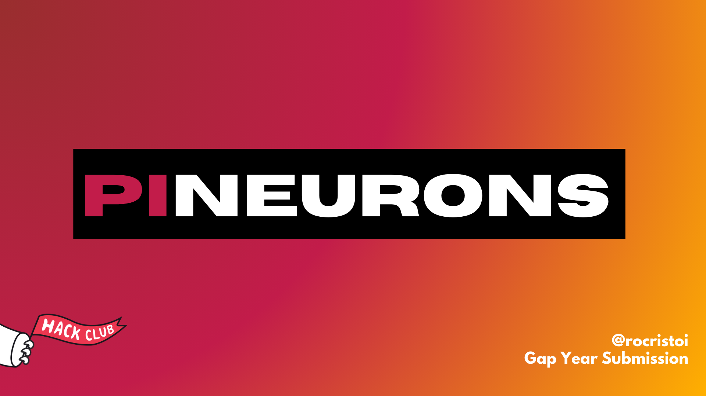

# 

Welcome to **PiNeurons**! Ever wanted to build your own personal AI to showcase to your friends? Now is your chance! 

Design a custom AI model from scratch, and we'll send you a **Raspberry Pi Zero 2 W** to run it on! In this project, you'll learn how to build your very own character-level Recurrent Neural Network (RNN) that generates text based on a "personality" you give it.


## What is PiNeurons?

PiNeurons is a **YSWS (You Ship, We Ship)** designed to introduce you to the core principles behind modern AI. While everyone is using tools like ChatGPT, very few understand how they actually work. PiNeurons bridges that gap by guiding you through building a small-scale language model from first principles.

Your model will be trained on your computer and is perfectly scoped to run on lightweight hardware (like your new Raspberry Pi!).


## What You'll Learn

By the end of this project, you will understand:
* **Data Representation:** How text is turned into numbers for AI to process.
* **Sequential Learning:** How neural networks learn patterns over time.
* **Data Quality:** How the data you feed an AI shapes its behavior.
* **Hyperparameters:** How tuning different settings changes your model's performance.
* **Text Generation:** The magic behind how AI predicts the "next word".


## Project Steps

To get the Raspberry Pi, you need to spend about **3+ hours** of active development on this project. You can always spend more time if you want to dive deeper!

### 1. Dataset Engineering 
You'll start by building a custom dataset. This decides your AI's "personality". You can choose themes like:
* Storytelling 📖
* Motivational content 💪
* Humor/Meme generation 😂
* Horror or suspense 👻

*Requirements:* 50–150 KB in size, consistent tone, and clean formatting. **Quality data equals a quality model!**

### 2. Model Training 
Using our provided codebase, you will train a character-level RNN on your dataset. The model learns by predicting the next character in a sequence, just like large language models do! 
*(Tip: You can find an example Python script to help you train the model inside the `/example` directory!)*

### 3. Hyperparameter Exploration 
Experiment with your model's settings to get the best results:
* Context window (Sequence length)
* Model capacity (Hidden layer size)
* Number of layers
* Output randomness (Sampling temperature)

### 4. Output Quality Optimization 
Your final AI must generate coherent text! 
* It should contain recognizable English words.
* It must reflect your chosen theme.
* It needs to maintain readability across 2–3 consecutive sentences.


## How to Submit & Get Your Raspberry Pi!

Once you have a working AI that meets the quality standards, it's time to submit!

1. **Fork this repository** and create a new branch.
2. Inside the `/submissions` folder, create a new folder with **your model's name** (e.g., `/submissions/MyAwesomeStoryAI/`).
3. Inside your new folder, upload the following files:
   * Your trained model file (`.pth` extension).
   * The Python code (`.py`) you used to train the model.
   * Your dataset, in a `.txt` file.
   * A `manifest.json` file configuring your submission.

### `manifest.json` Template
Make sure your JSON file looks exactly like this, filled with your details:

```json
{
    "name": "MyAwesomeStoryAI",
    "description": "A creative AI that generates short sci-fi stories.",
    "thematic": "Storytelling",
    "image": "https://link-to-your-image.com/image.png", 
    "model_file_name": "model.pth"
}
```
*(Note: The `image` field is optional, but if provided it must be a URL to a 1024x1024px image representing your AI!)*

4. **Create a Pull Request (PR)** to this repository.
5. We will evaluate your submission based on functionality and output quality. If accepted, we will ship your **Raspberry Pi Zero 2 W**! 🚢📦

Happy building, and we can't wait to see what you create!